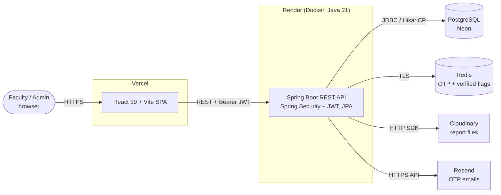
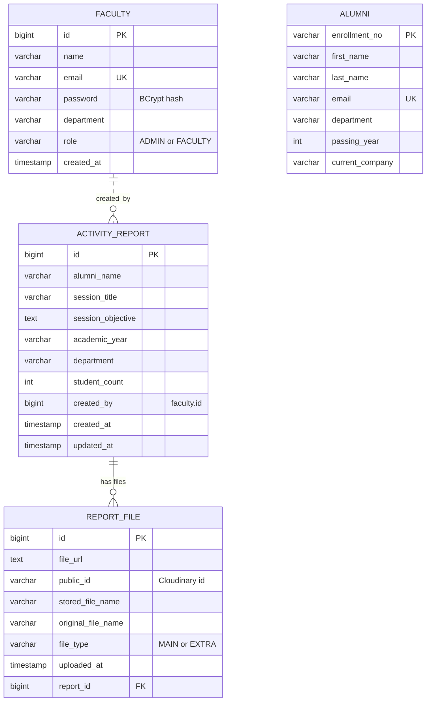
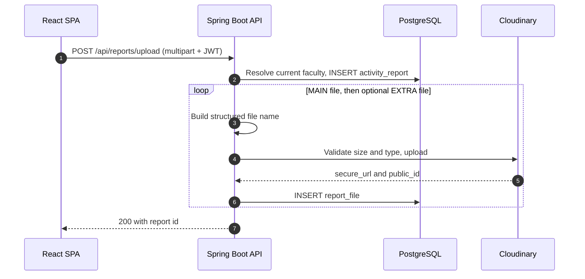

# Alumni Engagement & Activity Report Portal

A role-based web portal for the **Pune Institute of Computer Technology (PICT)** to record, manage, and analyse expert sessions delivered by alumni. Faculty upload session reports with supporting documents; administrators get a consolidated view, file downloads, and analytics dashboards.

**Live demo:** https://alumni-engagement-activity-report.vercel.app
*(The backend runs on a free tier, so the first request after a period of inactivity can take a while while it wakes up.)*

---

## Table of contents

- [Features](#features)
- [Tech stack](#tech-stack)
- [Architecture](#architecture)
- [Database design](#database-design)
- [Key flows](#key-flows)
- [Project structure](#project-structure)
- [API overview](#api-overview)
- [Getting started](#getting-started)
- [Deployment](#deployment)
- [Roadmap](#roadmap)

---

## Features

**Faculty**
- Register with **email OTP verification**; sign in with JWT-based authentication
- Upload an activity report: alumni name, session title, objective, academic year, department, student count
- Attach a **main report** and an optional **supporting document** (PDF, DOC/DOCX, CSV, XLS, PNG, JPG — up to 10 MB each) with live upload progress
- View, edit, and download **their own** reports; replace attached files
- Reset a forgotten password through the same OTP flow

**Admin**
- View **all** reports with pagination, filter by department / academic year, and search by alumni name
- Open a report's files and download any of them
- **Dashboard** with headline numbers and recent uploads
- **Insights** with charts: reports per academic year and department, students reached, monthly upload trend, and more

**Platform**
- Role-based access control (`ADMIN`, `FACULTY`) enforced on the server, with per-report **ownership checks** for faculty
- Stateless JWT authentication with automatic client-side logout on expiry
- Files stored in Cloudinary with structured, collision-free names; only metadata lives in the database
- Responsive UI

---

## Tech stack

| Layer | Technology |
|---|---|
| Backend | Java 21, Spring Boot 3.5, Spring Web, Spring Data JPA (Hibernate), Spring Security, JJWT, Lombok, Maven |
| Database | PostgreSQL (hosted on Neon) |
| Cache / OTP store | Redis (TLS) — OTPs and verification flags with TTL |
| File storage | Cloudinary (raw resources) |
| Email | Resend HTTP API |
| Frontend | React 19, Vite, React Router 7, Axios, Tailwind CSS, react-hot-toast, Recharts |
| Deployment | Docker (multi-stage) on Render · Vercel (frontend) · Neon (database) |

---

## Architecture



The API is **stateless**: authentication is a signed JWT, and OTP state lives in Redis, so multiple instances can run behind a load balancer.

Backend layering: **Controller → Service → Repository → PostgreSQL**, with a `FileStorageService` interface (Cloudinary implementation) so the storage provider can be swapped without touching business logic.

---

## Database design



- **`faculty`** holds both roles; passwords are stored as BCrypt hashes.
- **`activity_report`** is one row per alumni session; **`report_file`** holds the files of a report (one `MAIN`, optionally one `EXTRA`), linked by a foreign key with cascade delete.
- **`alumni`** is a record table reserved for the alumni-management module (see [Roadmap](#roadmap)).
- The schema is created and updated by Hibernate (`spring.jpa.hibernate.ddl-auto=update`).

*(The diagram shows the main columns; see the entity classes in `alumni-portal/src/main/java/.../entity` for the full list.)*

---

## Key flows

**Signup with OTP**
1. `POST /api/auth/send-otp` — a 6-digit OTP is stored in Redis (`OTP:<email>`, 5-minute TTL) and emailed.
2. `POST /api/auth/verify-otp` — on a match the OTP is deleted and a single-use `VERIFIED:<email>` flag (10-minute TTL) is set.
3. `POST /api/auth/register` — requires the flag, hashes the password with BCrypt, creates the user with role `FACULTY`, and clears the flag.

**Authenticated requests**
`POST /api/auth/login` returns a signed JWT (email + role, 10-hour expiry). The frontend attaches it as `Authorization: Bearer <token>`; a servlet filter validates it and Spring Security applies role rules per route.

**Uploading a report**



**Downloading a file** — the request goes through the API, which checks authorization (owner for faculty, any file for admin), fetches the file from Cloudinary, and streams it back with the original file name.

---

## Project structure

```
.
├── Dockerfile                 # Multi-stage build for the backend (used on Render)
├── alumni-portal/             # Spring Boot backend
│   ├── pom.xml
│   └── src/main/java/com/pict/alumni/alumni_portal/
│       ├── auth/              # OTP, register, login, reset password
│       ├── config/            # Security, CORS, Redis, Cloudinary configuration
│       ├── controller/        # REST controllers (admin/, faculty/, alumni/)
│       ├── service/           # Business logic (admin/, faculty/, impl/)
│       ├── repository/        # Spring Data JPA repositories
│       ├── entity/            # JPA entities
│       ├── dto/               # Request/response objects
│       ├── security/          # JWT service and authentication filter
│       ├── storage/           # File storage abstraction + Cloudinary implementation
│       └── exception/, util/
└── frontend/                  # React + Vite single-page app
    └── src/
        ├── pages/             # Login, signup flow, upload, reports, dashboard, insights
        ├── components/        # Sidebar, Navbar, ReportTable, modals, route guard
        ├── layouts/           # Auth, Faculty and Admin layouts
        ├── context/           # AuthContext (token + user state)
        ├── services/          # API functions (auth, reports, admin)
        └── utils/             # Axios instance, constants, backend warm-up
```

---

## API overview

| Method | Endpoint | Access | Description |
|---|---|---|---|
| POST | `/api/auth/send-otp` | Public | Send an OTP to an email |
| POST | `/api/auth/verify-otp` | Public | Verify the OTP |
| POST | `/api/auth/register` | Public | Register a faculty account (needs a verified email) |
| POST | `/api/auth/login` | Public | Log in, returns a JWT |
| POST | `/api/auth/reset-password` | Public | Reset password (needs a verified email) |
| POST | `/api/reports/upload` | Faculty / Admin | Upload a report (multipart) |
| GET | `/api/faculty/reports` | Faculty / Admin | List my reports (`page`, `size`) |
| GET | `/api/faculty/reports/{id}` | Faculty / Admin | Get one of my reports |
| PUT | `/api/faculty/reports/{id}` | Faculty / Admin | Update report details (owner only) |
| PUT | `/api/faculty/reports/{reportId}/files/{fileId}` | Faculty / Admin | Replace a file (owner only) |
| GET | `/api/faculty/files/{fileId}/download` | Faculty / Admin | Download my file |
| GET | `/api/admin/reports` | Admin | List all reports (`page`, `size`) |
| GET | `/api/admin/reports/{reportId}/files` | Admin | Files of a report |
| GET | `/api/admin/files/{fileId}/download` | Admin | Download any file |
| GET | `/health` | Public | Health check |

Protected endpoints require the header `Authorization: Bearer <token>`.

---

## Getting started

### Prerequisites

- JDK 21
- Node.js 20 or newer
- PostgreSQL (local, or a free [Neon](https://neon.tech) database)
- Redis (local, or a hosted instance)
- A [Cloudinary](https://cloudinary.com) account (free tier is enough)
- A [Resend](https://resend.com) API key (for OTP emails)

### 1. Clone

```bash
git clone https://github.com/Hnm-31/Alumni-Engagement-and-Activity-Report-Portal.git
cd Alumni-Engagement-and-Activity-Report-Portal
```

### 2. Backend

The backend reads its configuration from **environment variables** (Spring Boot does not load a `.env` file automatically — export them in your shell or set them in your IDE run configuration).

| Variable | Description |
|---|---|
| `POSTGRESQL_URL` | JDBC URL, e.g. `jdbc:postgresql://localhost:5432/alumni` |
| `PUSERNAME` | Database username |
| `PASSWORD` | Database password |
| `REDIS_HOST` | Redis host |
| `REDIS_PORT` | Redis port |
| `REDIS_PASS` | Redis password |
| `CLOUD_NAME` | Cloudinary cloud name |
| `API_KEY` | Cloudinary API key |
| `API_SECRET_KEY` | Cloudinary API secret |
| `RESEND_API_KEY` | Resend API key used to send OTP emails |
| `JWT_SECRET` | Secret used to sign JWTs — generate one with `openssl rand -hex 32` |

```bash
export POSTGRESQL_URL="jdbc:postgresql://localhost:5432/alumni"
export PUSERNAME="your_db_user"
export PASSWORD="your_db_password"
export REDIS_HOST="localhost"
export REDIS_PORT="6379"
export REDIS_PASS="your_redis_password"
export CLOUD_NAME="your_cloud_name"
export API_KEY="your_cloudinary_key"
export API_SECRET_KEY="your_cloudinary_secret"
export RESEND_API_KEY="your_resend_key"
export JWT_SECRET="$(openssl rand -hex 32)"

# Redis TLS is enabled by default in application.properties.
# For a local Redis without TLS, override it:
export SPRING_DATA_REDIS_SSL_ENABLED=false

cd alumni-portal
./mvnw spring-boot:run        # Windows: mvnw.cmd spring-boot:run
```

The API starts on `http://localhost:8080`, and Hibernate creates the tables on first run. Check `http://localhost:8080/health`.

### 3. Frontend

```bash
cd frontend
npm install
echo "VITE_API_BASE_URL=http://localhost:8080" > .env.local
npm run dev
```

Open `http://localhost:5173`.

### 4. Create an admin account

Registration only creates `FACULTY` accounts. To get an admin, register normally through the UI, then promote that user in the database:

```sql
UPDATE faculty SET role = 'ADMIN' WHERE email = 'you@example.com';
```

Log in again and you will be routed to the admin dashboard.

### Notes

- Departments and academic-year options are defined in `frontend/src/utils/formConstants.js`.
- Resend's shared test sender (`onboarding@resend.dev`) can only deliver to the account owner's address. To send OTPs to any user, verify your own domain in Resend and update the `from` address in `EmailService`.

---

## Deployment

| Component | Platform | Notes |
|---|---|---|
| Frontend | **Vercel** | Root directory `frontend`, build `npm run build`, output `dist`. Set `VITE_API_BASE_URL` to the backend URL. `vercel.json` rewrites all routes to `index.html` for client-side routing |
| Backend | **Render** (Docker) | Uses the root `Dockerfile` (Maven build on JDK 21, runtime on a JRE image, listens on `$PORT`). Set the environment variables above. Health check path: `/health` |
| Database | **Neon** PostgreSQL | Connection pool settings in `application.properties` handle the serverless database waking from idle |
| Redis | Any hosted Redis with TLS | Stores OTPs and verification flags |
| Files | **Cloudinary** | Reports are stored under `alumni/activity-reports` and `alumni/additional-docs` |

Because the free-tier backend sleeps when idle, the frontend pings `/health` as soon as it loads to wake it early.

---

## Roadmap

- Server-side filtering, search, and analytics endpoints (aggregate in SQL instead of in the browser)
- Bean Validation on all request DTOs and clearer error responses (400/403/404 instead of a generic 500)
- OTP rate limiting and attempt limits; optional domain restriction / admin approval for faculty signup
- Refresh tokens and shorter-lived access tokens
- Alumni records and **alumni visit** management module (entities are scaffolded)
- Automated tests (unit, `@WebMvcTest`, Testcontainers) and CI pipeline
- Database migrations with Flyway
